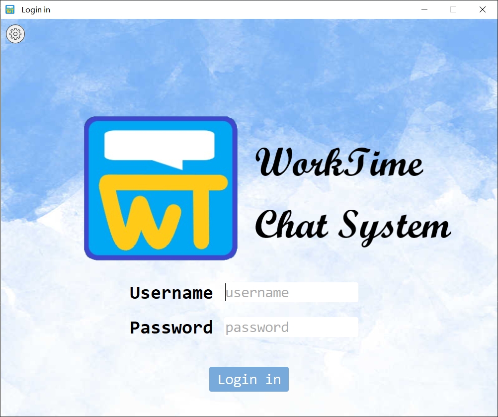
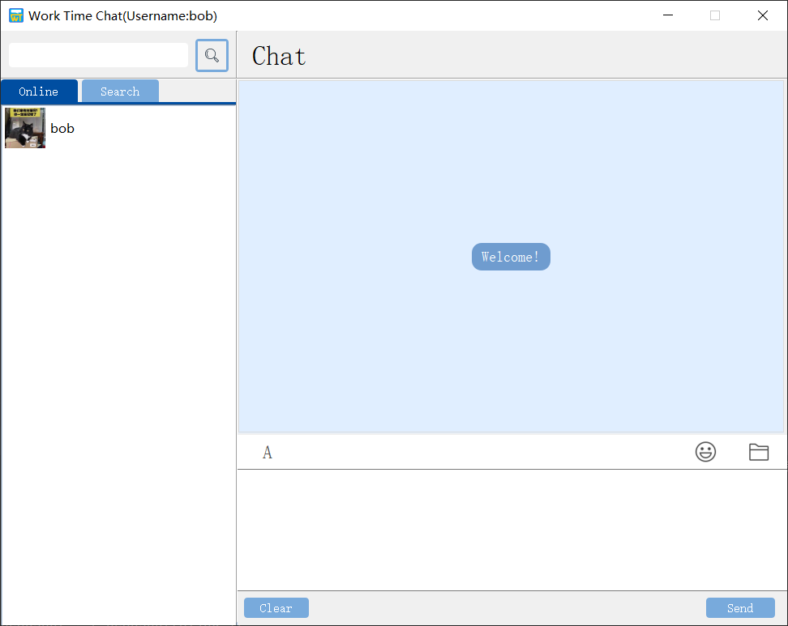
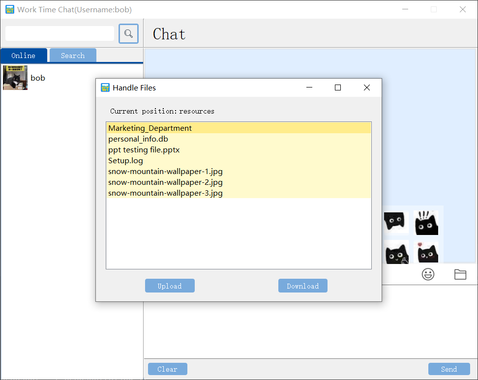

# Chatting Room

-----

>  Team:
>
>  [@Hongbo Wang ](https://github.com/BOBWang1117)
>
>  @Yichu Li
>
>  @Jiayin Li
>
>  @Jingwen Liu
>
>  

## **Environment:**

- Python 3.9.6

  

## **Details**

- Type: term project

- Teacher: 张涛

- Computer Language: Python

- Project Name: Chatting Room

- Time: 2020/12/31

- Description: The software is a company chat software, which realizes the transfer of text, expressions, pictures and files. Among them, there are server-side and client-side, server-side and database connection, which are used to read basic information such as employee information. This software is designed and tested black box, white box, etc. The development process follows the sequence of software engineering.

## **Dependencies:** 

- None

## **Install package:**

- A lot

## **Run program:**

- Run server first

- Then run client

  

  

 

## **Example:**

1. 

   

2. 

   

3. 

   

